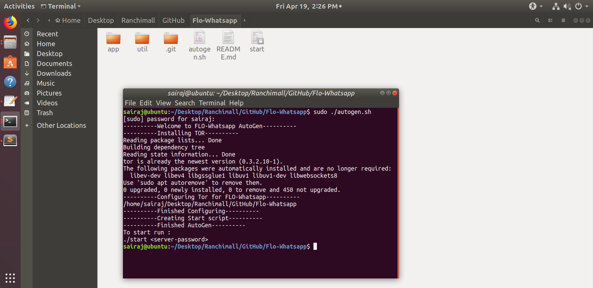
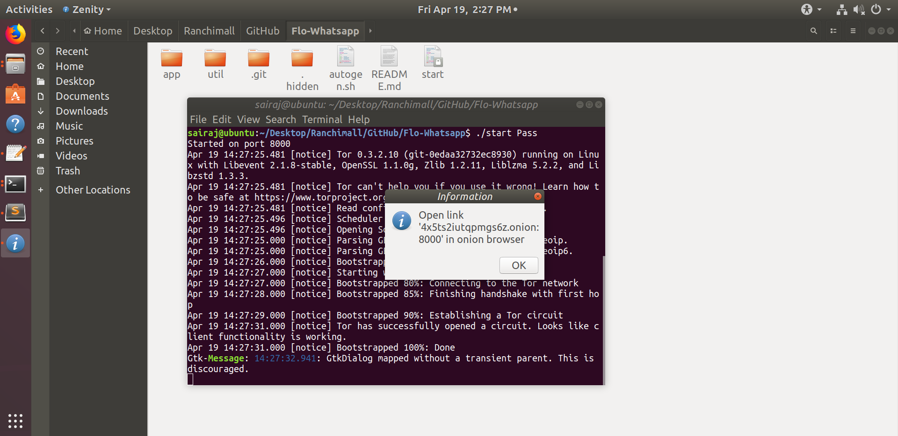
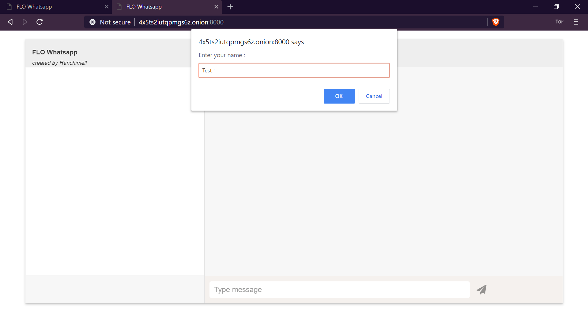
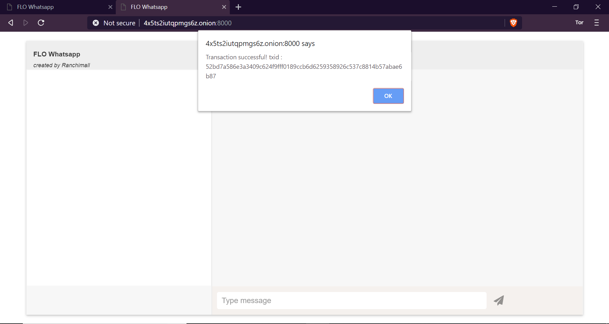
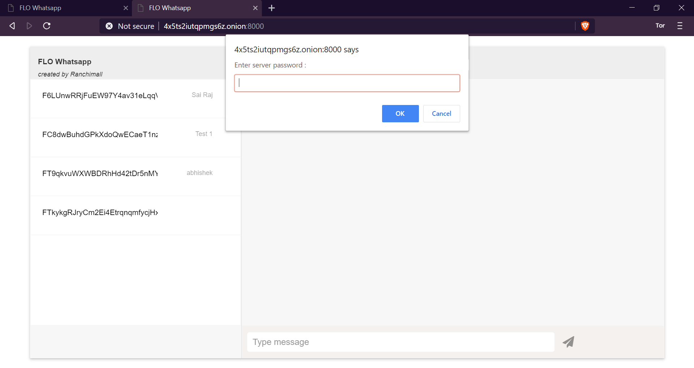
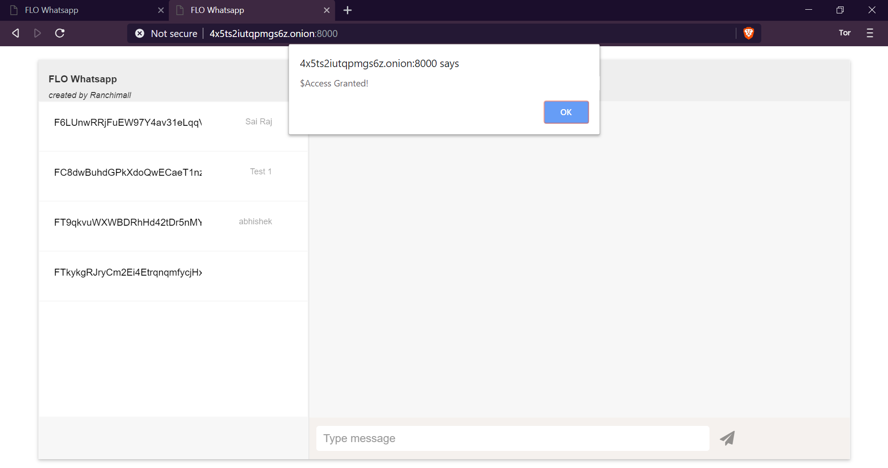
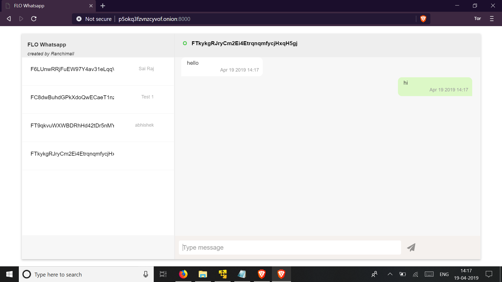
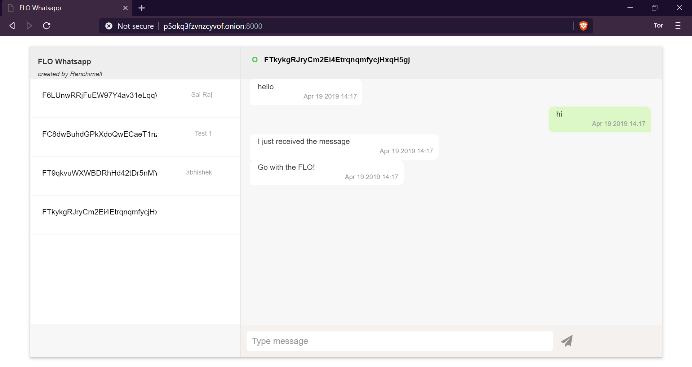
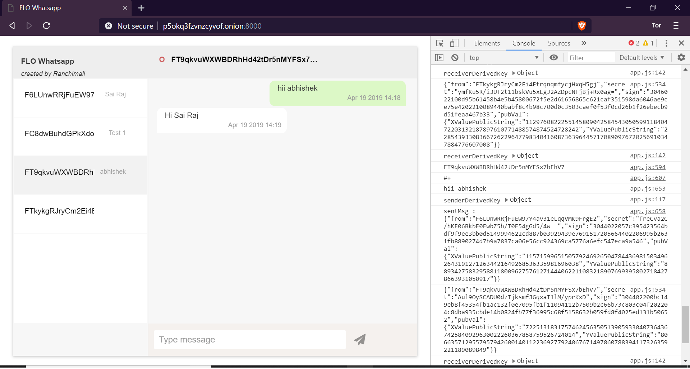

# Flo-Whatsapp: Introduction 
This is a peer-peer Whatsapp like chat application totally encrypted in transit without needing a central server. Current web based technologies have a inbound address problem namely ordinary web users do not have a fixed IP, so it is not easy to establish connection to them. We propose to solve that problem by using TOR addresses for ordinary users which can provide a fixed inbound routable address on Internet for everyone including for those on dynamic IPs. Ever since Brave Browser an almost perfect clone of Google Chrome introduced TOR based browsing, it has become very easy to connect to a TOR based service. We believe it can form a stable architecture for peer to peer services. Another limitation of current web based technologies is ordinary users cannot allocate a fixed port using just their web browsers for inbound connections. So every user will need to run his own webservers on which he can receive chat messages. We could not find a way to eliminate webservers. But we have found a very simple webserver called Mongoose Webserver, where a user can invoke a fixed port based service on click of a single button. To facilitate globally unique identification of every peer, we propose to use FLO Blockchain IDs. Then user can then attach his TOR address onto his FLO id inside the FLO Blockchain. Since the blockchain data is immutable, it will provide a continous uniterruptable source of connection information based on user's FLO ID.  

## Requirements
1. Ubuntu OS or its derivatives
2. Onion Browser (Brave for Desktop or Orfox for Android)
3. FLO ID

## Steps to Install
1. Download or Clone this repo

        git clone https://github.com/ranchimall/Flo-Whatsapp
2. Open terminal in the directory
        
        cd Flo-Whatsapp
3. Run autogen.sh to install tor, configure tor and create the start file.
 
        sudo ./autogen.sh

## Steps to Start FLO-Whatsapp
1. run start in terminal (in the FLO-Whatsapp directory). Enter a strong server-password which will be used to connect in step 6.

        ./start <server-password>
2. FLO-Whatsapp server and Tor will be started automatically. (Hidden_service will be created on the 1st time). Your hidden_service onion address will be displayed in information dialog box

3. Open the onion address (url) in Onion browser (Brave for desktop or Orfox for android) [not necessary to be on the same device]
4. Enter the FLO_ID private key when prompted. [FLO_ID can be generated using flo_webWallet (https://flo-webwallet.duckdns.org/) or flo-core wallet (https://github.com/ranchimall/FLO-wallet-core)] [!FLO_ID private key is most important !DO NOT lose or share it]

5. New users and users changing the onion address will require to register in the FLO blockchain. (The registration is automatic, just click on ok when prompted and enter your name). A minimum amount will be required to register [Balance recharge can be done using https://international.bittrex.com/]. Upon successful registration the txid will be alerted 

6. Enter the server-password when prompted. Access will be granted when entered correct server-password (from step 1)

### Now your are connected to FLO-Whatsapp. 
1. Click on the contact (FLO_ID) you wish to send message
2. Check for the recipient status (Red circle to offline & Green circle for online)
3. If the recipient is online, Type the message and click send.
4. Messages received from other FLO_ID will be displayed when you click on the respective FLO_ID

## Other infos
The messages are signed and encrypted.
1. Uses sender's FLO private-key to sign the message on sending
2. Uses receiver's FLO public-key to encrypt the message on sending
3. Uses receiver's FLO private-key to decrypt the message on receiving
4. Uses sender's FLO public-key to verify the message on receiving

